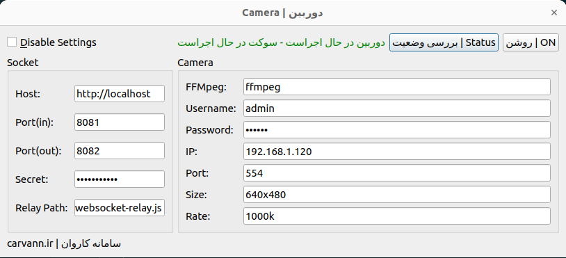

### Demo

### Create `.exe` file using PyInstaller

    pyinstaller  main.py -w --exclude-module _bootlocale --paths='C:\Users\mosta\Desktop\camera\camera-websocket-runner\.venv\Lib\site-packagesC:\Users\mosta\Desktop\camera\camera-websocket-runner\.venv\Lib\site-packages' --add-data="C:\Users\mosta\Desktop\camera\camera-websocket-runner\*;."

